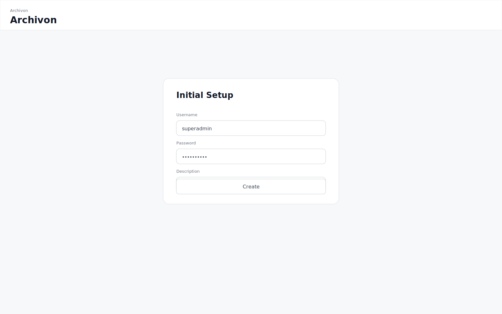
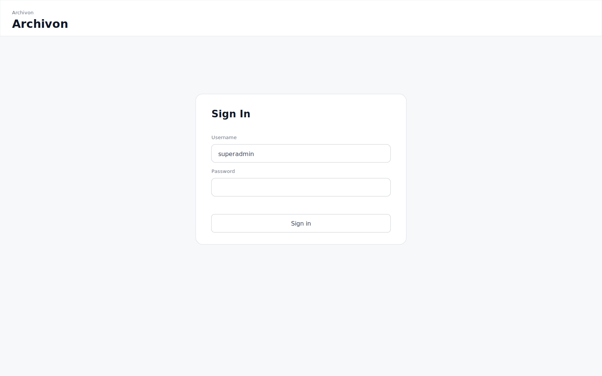
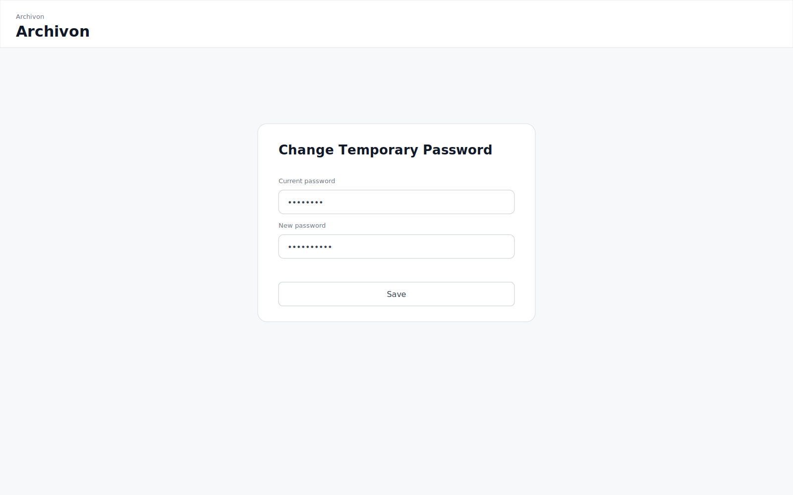
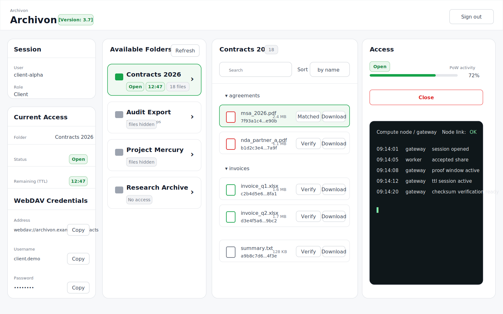
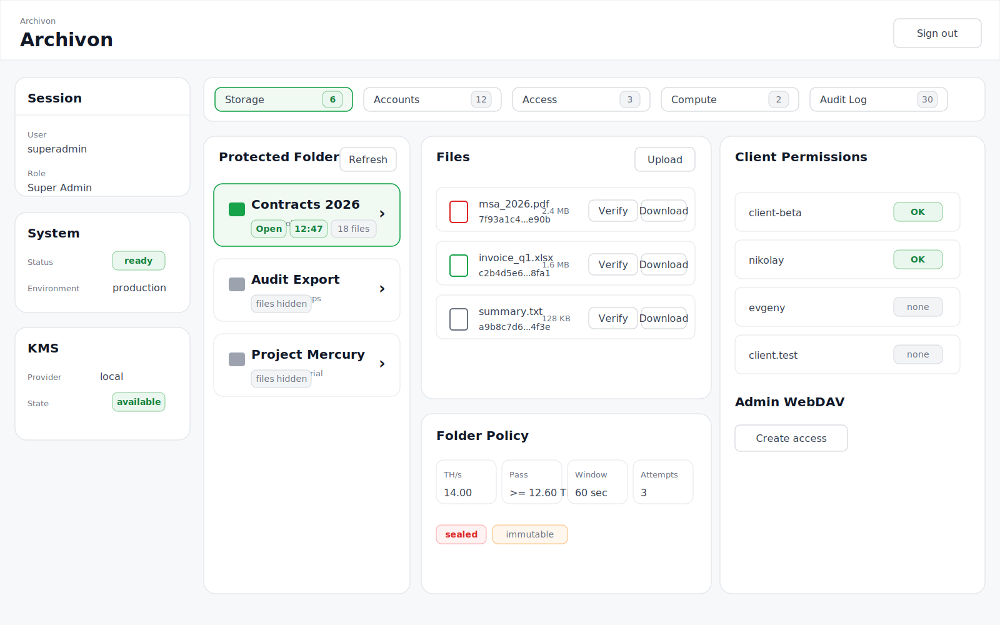
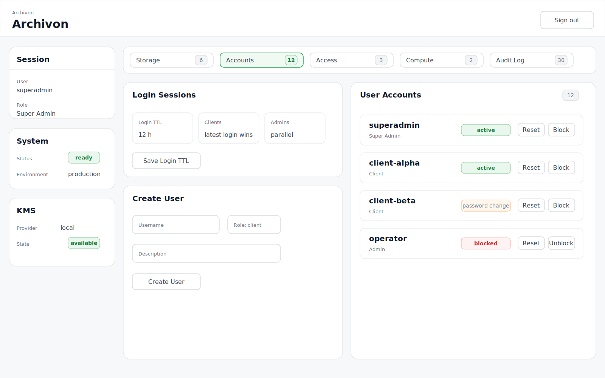
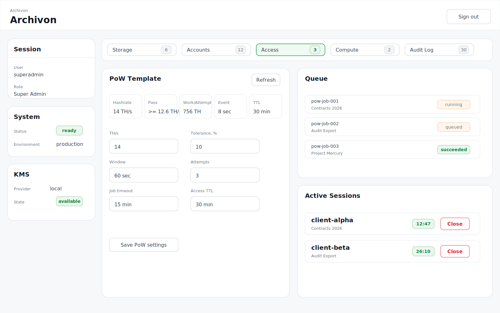
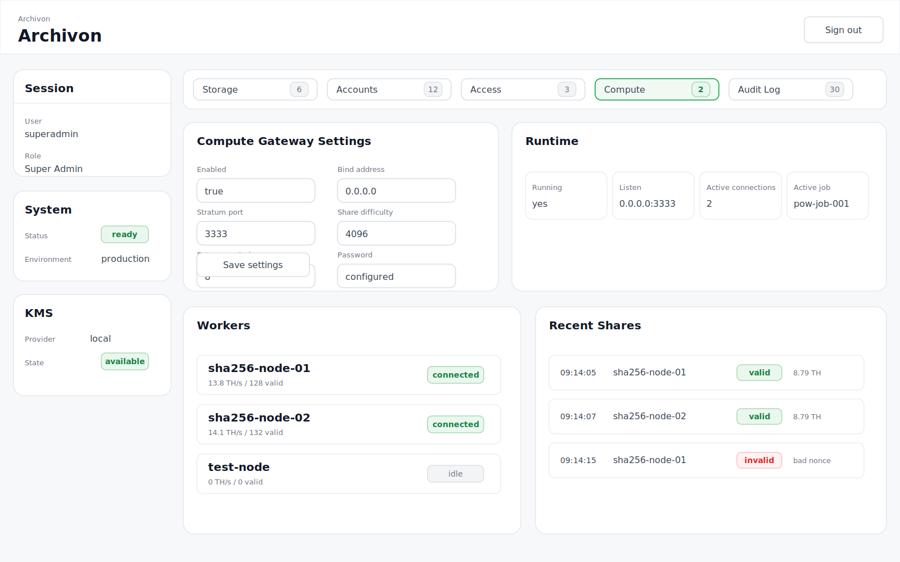
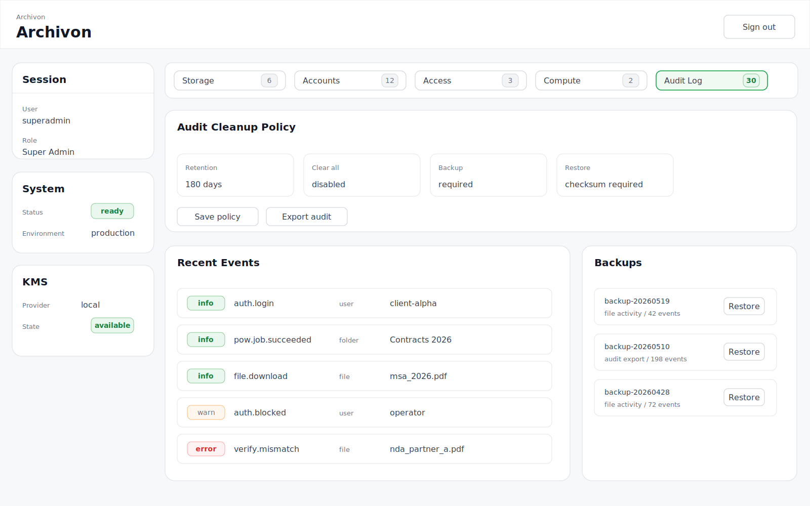

# Archivon Interface Example

This directory contains static interface examples for Archivon Core.

The examples are synthetic UI reference screens based on the current frontend structure. They are not production screenshots and do not contain real operator data, infrastructure addresses, worker names, credentials, customer files, or deployment logs.

## 1. Visual Style

The interface should read as a practical security and archival storage dashboard:

- light page background;
- white work surfaces;
- soft borders;
- green accents for `Open`, `OK`, and `Matched`;
- amber accents for warnings;
- red accents for dangerous actions;
- dark terminal surface for compute and gateway logs;
- restrained decoration, high readability.

## 2. Application Frame

```text
Header
|-- Side Panel
`-- Work Panel
    |-- Cards
    |-- Forms
    |-- Tables
    `-- Terminal
```

## 3. Interface Screens

### 3.1 Initial Setup

First-run setup before a super administrator exists.



Contains:

- `Username`;
- `Password`;
- `Description`;
- `Create` action.

---

### 3.2 Sign In

User sign-in screen.



Contains:

- `Username`;
- `Password`;
- `Sign in` action.

---

### 3.3 Change Temporary Password

Forced change for a temporary password.



Contains:

- `Current password`;
- `New password`;
- `Save` action.

---

### 3.4 Client Workspace

Main client workspace.



Main areas:

- `Session`;
- `Current Access`;
- `Available Folders`;
- `Files`;
- `Access`;
- `Compute node / gateway`.

Behavior:

- files remain hidden until a folder is opened;
- access is opened with `Open`;
- the button changes to `Close` during an active TTL session;
- `Verify` compares a local file SHA-256 hash with the Archivon checksum;
- `Download` is available only during an active session;
- WebDAV credentials are shown only during an active TTL session.

---

### 3.5 Admin / Storage

Administrative storage screen.



Purpose:

- protected folders;
- files;
- upload;
- backup import/export;
- client permissions;
- admin WebDAV;
- immutable folder policy.

---

### 3.6 Admin / Accounts

User account management.



Purpose:

- login TTL;
- user creation;
- roles;
- reset password;
- block / unblock;
- delete user.

---

### 3.7 Admin / Access

Proof-of-Work access configuration.



Purpose:

- PoW template;
- target TH/s;
- tolerance;
- proof window;
- attempts;
- job timeout;
- access TTL;
- job queue;
- active TTL sessions.

---

### 3.8 Admin / Compute

Compute gateway and worker monitoring.



Purpose:

- Stratum gateway settings;
- runtime status;
- active connections;
- workers;
- recent shares;
- reset worker stats.

---

### 3.9 Admin / Audit Log

Audit log.



Purpose:

- audit events;
- severity;
- file-related activity;
- retention policy;
- backups;
- restore with checksum.

## 4. Core UI States

| State | Visual style | Examples |
|---|---|---|
| Success | green badge | `Open`, `OK`, `Matched` |
| Warning | amber badge | TTL warning, `password change` |
| Error / dangerous | red accent | `Delete`, `Close`, `mismatched` |
| Disabled | gray muted state | `No access`, `files hidden` |

## 5. Rules For New Screens

New screens should preserve the same flow:

```text
Header -> Side Panel -> Work Panel -> Card -> Action
```

Controls:

- primary action: normal button;
- secondary action: `secondary-inline`;
- dangerous action: `danger-inline`;
- status: `tag` / `badge`;
- help: `HelpTip` / `data-tooltip`.

## 6. Repository Location

```text
frontend/
  docs/
    interface/
      README.md
      images/
        01-auth-initial-setup.svg
        02-auth-sign-in.svg
        03-auth-change-password.svg
        04-client-workspace.svg
        05-admin-storage.svg
        06-admin-accounts.svg
        07-admin-access.svg
        08-admin-compute.svg
        09-admin-audit.svg
```
